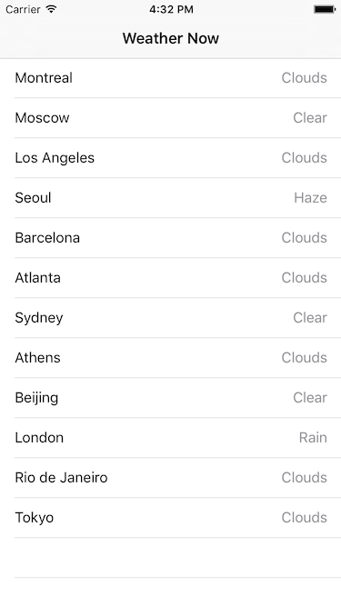

# Swift Viper Weather App

This is an example project to demonstrate:
* [MVVM](https://www.raywenderlich.com/34-design-patterns-by-tutorials-mvvm) architecture
* [Swinject](https://github.com/Swinject/Swinject)
* [Moya](https://github.com/Moya/Moya)
* [Realm](https://github.com/realm/realm-cocoa)
* [RxSwift](https://github.com/ReactiveX/RxSwift)
* [XcodeGen](https://github.com/yonaskolb/XcodeGen)

in a simple weather app that lists current weather information at some locations.

## Requirements

- Xcode 11 or later
- Swift 5 or later
- [CocoaPods](https://cocoapods.org) 1.8.0 or later

## Setup

1. Download the source code or clone the repository.
2. Run `bundle install && bundle exec fastlane prepare`.
3. Get a free API key from [OpenWeatherMap](http://openweathermap.org).
4. Open `OpenWeatherAPI.swift` and fill `apiKey = ""` with your own API key.

## License

MIT license. See the `LICENSE` file for details.
